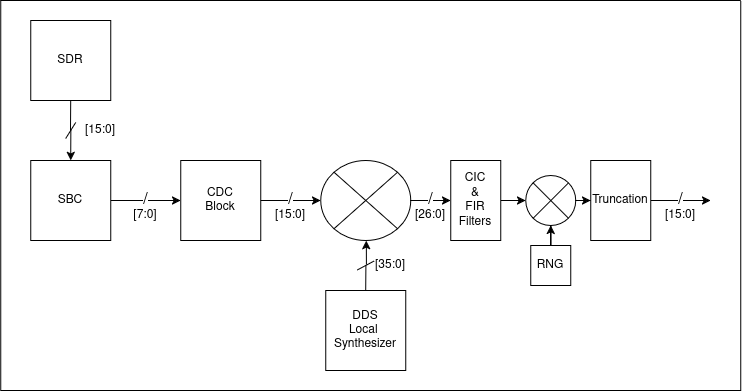

# RF-SDR-Frontend

## Overview
The goal of this project is to implement an RF Software Defined Radio (SDR) Frontend to interface with FPGA signal processing blocks. This frontend handles initial signal acquisition, mixing, filtering, and decimation, serving as a critical upstream component of the overarching project to analyze LoRa data using the ULX3S FPGA. The frontend uses the [rf-dds-lo](https://github.com/nicocavallu/rf-dds-lo) sister repository as a local oscillator for mixing to feed filtered baseband data into Fourier processing blocks.

## System


The DSP pipeline consists of the following hardware blocks:

* **SDR Interface & SBC Formatting:** Receives an 8-bit `[7:0]` digital sample stream (`sdr_signal_in`) synchronized via an SBC strobe control signal.
* **Clock Domain Crossing (CDC):** Safely transfers asynchronous input samples into the main DSP processing clock domain.
* **DDS-LO & Complex Mixer:** Mixes incoming samples with an 18-bit DDS sine/cosine carrier (`signal_out`), producing 27-bit `[26:0]` complex (I/Q) intermediate signals.
* **CIC Decimator Filter:** Multi-stage integrator-comb filter that decimates the sample rate using 45-bit `[44:0]` internal accumulator registers to prevent overflow.
* **FIR Anti-Aliasing Filter:** 31-tap symmetric FIR filter loaded with 16-bit coefficients (`fir_coeff.mem`) for sharp baseband shaping and CIC droop compensation.
* **TPDF Dithering & Bit Truncation:** Applies 4-bit TPDF PRNG dither to break up quantization noise patterns before truncating the signal to the final 18-bit `[17:0]` output stream (`I_OUT`, `Q_OUT`).

## Hardware Requirements 

### FPGA Platform:
[Radiona ULX3S](https://radiona.org/ulx3s/) (Lattice ECP5 LFE5U-85F)

### SDR Platform:
[HackRF Pro](https://greatscottgadgets.com/hackrf/pro/) 

## Decoding Specifications:  
Assuming a standard US 915 MHz LoRa signal, the ULX3S 25MHz clock, and target IF processing:

* **Target Center Frequency:** 915 MHz  
* **ADC Sampling Rate:** 20MSPS  
* **Digital Down-Conversion Bandwidth:** 125kHz  
* **Output Word Size:** 18 bits `[17:0]`


## Software Environment and Requirements

### Operating System:   
This project was developed in an Arch Linux environment using open-source hardware toolchain dependencies. 

### Dependencies:  
* iverilog  
* gtkwave  
* yosys 
* nextpnr-ecp5  
* fujprog
* python3
* numpy

## Quick Start:

An automated shell script 'run_sim.sh' is provided in the root directory to execute the entire SDR pipeline from scratch. To run the full frontend, go to the `/scripts` directory and make the script an executable

```bash
cd scripts  
chmod +x sdr_frontend_test.sh  
./sdr_frontend_test.sh
```

This repository includes a .lpf file for hardware integration of the ULX3S FPGA board.

## Reference:  
[HackRF Course](https://www.greatscottgadgets.com/sdr/)  
[Dithering](https://en.wikipedia.org/wiki/Dither)
[FIR Filters](https://www.elprocus.com/fir-filter-for-digital-signal-processing/)
